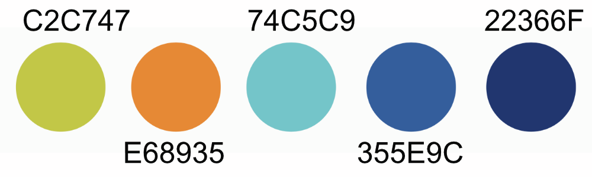

# DDLitab Webseite

Link: https://softiceee.github.io/ddlit-prototype/

## Colors

- c2c747
- e68935
- 74c5c9
- 355e9c
- 22366f



## Getting Started

To run this project locally, you need to have Hugo and Git installed on your machine. Additionally, you can use Visual Studio Code as your code editor.

### Installations

* [Install Hugo](https://gohugo.io/installation/)
* [Install Git](https://git-scm.com/book/en/v2/Getting-Started-Installing-Git)
* [Install VS Code](https://code.visualstudio.com/download) (gibt es auch in der RRZ Softwareverwaltung)

#### macOS

Open a Terminal.
* Install [Homebrew](https://brew.sh/) (Package Manager for macOS): ```/bin/bash -c "$(curl -fsSL https://raw.githubusercontent.com/Homebrew/install/HEAD/install.sh)"```
* Install Hugo: `brew install hugo`
* Install Git: `brew install git`

### Setting up the local repository

Open a terminal inside VS Code (Terminal > New Terminal).

Switch to a directory where you want to store your code (e.g. `~/code`)

> `~` is your home directory (E.g. `/Users/david` on macOS)

```cd ~/code```

Clone this repository:

```git clone https://github.com/softiceee/ddlit-prototype.git```

Now you have a local copy of the repository. You can switch to the directory:

```cd ddlit-prototype```

### Running the website locally

You can run the site locally:

```hugo server```

This starts a local webserver which you can access in your browser at `http://localhost:1313`.

### Branches

There are two branches in this repository:
- `main`: This is the main branch. This is the "production" branch. It is automatically deployed to the live website. We try to keep this branch stable and only merge changes that are ready for publication.
- `develop`: This is the development branch. This is where we do our development work. We can merge changes from this branch into the main branch when they are ready for publication. You will always work in this branch.

To checkout the develop branch, run:

```git checkout develop```

Now, your changes are tracked in the develop branch.

### Making changes

You can make changes to the website in the `content` directory. This is where all the content of the website is stored. You can try to change something in the file `content/about.md`. This is the "About" page of the website. You add some text in this file and save it. The local webserver will automatically reload the page in your browser.

> Edit the file in VS Code. You can open the file by clicking on it in the Explorer view (left sidebar). After editing, save the file by pressing `cmd + s` (macOS) or `ctrl + s` (Windows/Linux). The local webserver will automatically reload the page in your browser.

